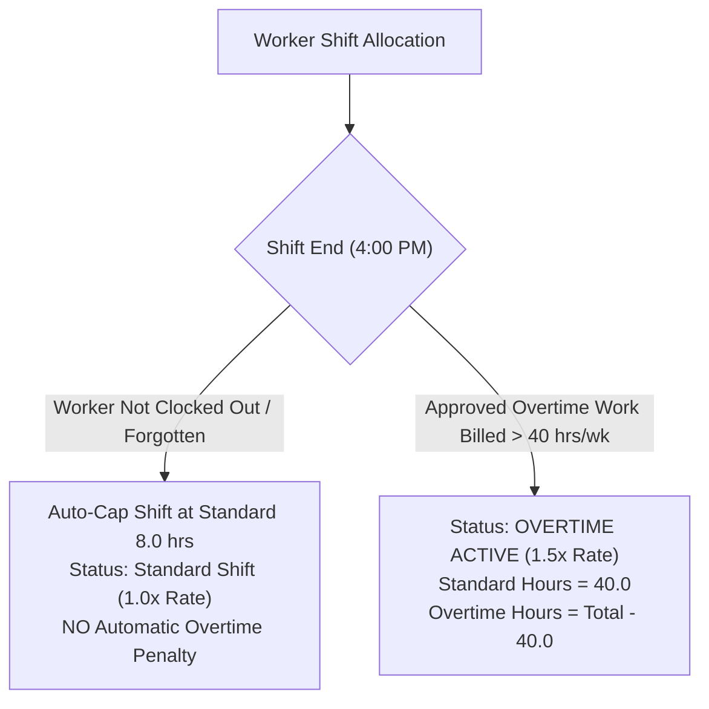
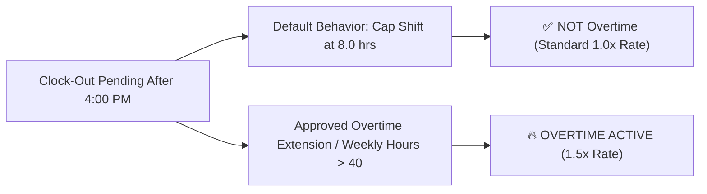

# Calculation Specification Guide: Attendance, Timesheets & Payroll

**System**: Worker Allocation & Site Management System  
**Document**: Calculation Rules & Business Logic  
**Shift Hours**: **7:00 AM – 4:00 PM** (9.0 Total Shift Duration, 1.0 Hr Lunch Break, 8.0 Billable Hrs)  
**Date**: July 28, 2026  

---

## 📌 Executive Overview

This document provides the exact technical and mathematical specifications for how **Attendance Statuses**, **Timesheet Billed Hours**, **Shift Closure Rules**, **Overtime Determination**, and **Gross Payroll Amounts** are calculated across construction site allocations.

---

## 1. Shift Schedule & Attendance Status Badges

The standard construction field working schedule is **7:00 AM to 4:00 PM**.

### Standard Working Hours Structure
- **Shift Start**: `07:00 AM`
- **Shift End**: `04:00 PM`
- **Total Duration**: `9.0 Hours` (includes 1.0 hr unpaid lunch/rest break)
- **Billable Credit**: `8.0 Hours` per standard day shift

### Attendance Status Thresholds

| Status Badge | Code | Shift Clock-In Threshold | Impact on Billed Hours |
| :--- | :---: | :--- | :--- |
| **Present** | **P** | Clock-in time $\le$ `07:00 AM` | Full standard shift credit (8.0 billable hrs). |
| **Late** | **L** | Clock-in time $>$ `07:00 AM` | Logged with exact clock-in timestamp (e.g. 07:15 AM). Shift hours adjusted according to late arrival offset. |
| **On-Site** | **O** | Shift in progress (`07:00 AM` – `04:00 PM`) | Active field tracking prior to 4:00 PM shift completion. |
| **Absent** | **A** | Unexcused absence / no show | 0.0 hrs billed for that site allocation day. |

---

## 2. Shift Closure & Overtime Determination Rules

### 2.1 Important Clarification: Forgotten / Unclosed Clock-Outs
> [!IMPORTANT]
> If a worker has **not been logged out after 4:00 PM** (e.g., forgotten clock-out or pending supervisor shift audit), the system **DOES NOT** automatically count extra hours as Overtime.
> 
> Unclosed shifts are automatically capped at the **standard 8.0 billable hours** (7:00 AM – 4:00 PM). Overtime is **NOT** granted accidentally due to a missing clock-out timestamp.

---

### 2.2 When Is Overtime Actually Triggered?

Overtime is **ONLY** triggered under two explicit conditions:

1. **Weekly Accumulated Hours Threshold (Weekly Overtime)**:
   - When a worker's total verified billable hours for the week exceed **40.0 hours** (e.g. working 6 days a week at 8.0 hrs/day = 48.0 total hrs).
   - Hours up to 40.0 are billed at **1.0x Base Rate**.
   - Hours beyond 40.0 (e.g., 8.0 hrs) are billed at **1.5x Overtime Rate**.

2. **Explicit Supervisor-Approved Shift Extension (Daily Overtime)**:
   - When a site engineer or supervisor explicitly logs an approved overtime shift extension (e.g., worker assigned to emergency concrete pour until 6:00 PM, logging 10.0 hours).

---

### 2.3 Summary Matrix: Overtime Determination

| Scenario | Clock-Out Timestamp | Billed Hours Granted | Overtime Status | Pay Rate Multiplier |
| :--- | :--- | :---: | :---: | :---: |
| **Normal Clock-Out** | Logged at `04:00 PM` | $8.0\text{ hrs}$ | **NOT OVERTIME** | **1.0x Base Rate** |
| **Unclosed / Forgotten Clock-Out** | Not logged by 4:00 PM | $8.0\text{ hrs}$ (Auto-Capped) | **NOT OVERTIME** | **1.0x Base Rate** |
| **Approved Overtime Extension** | Explicitly logged past 4:00 PM | $> 8.0\text{ hrs}$ | **🔥 OVERTIME ACTIVE** | **1.5x Base Rate** on excess hrs |
| **6-Day Full Work Week** | Mon–Sat (6 shifts) | $48.0\text{ hrs}$ total | **🔥 OVERTIME ACTIVE** | **1.5x Base Rate** on $8.0\text{ hrs}$ |

---

## 3. Trade Base Hourly Rates Matrix

Base hourly rates are determined by licensed trade specialty and position level:

| Trade Specialty | Skill Level / Position | Standard Rate (1.0x) | Overtime Rate (1.5x) |
| :--- | :--- | :---: | :---: |
| **Foreman** | Senior / Lead Supervisor | **$48.00 / hr** | **$72.00 / hr** |
| **Electrician** | Licensed / Senior | **$42.00 / hr** | **$63.00 / hr** |
| **Carpenter** | Master / Journeyman | **$38.00 / hr** | **$57.00 / hr** |
| **Laborer** | Apprentice / Assistant | **$30.00 / hr** | **$45.00 / hr** |

---

## 4. Gross Estimated Payroll Formula

$$\text{Gross Estimated Pay} = (\text{Standard Hours} \times \text{Base Rate}) + \left(\text{Overtime Hours} \times (\text{Base Rate} \times 1.5)\right)$$

---

## 📊 Summary Table

| Metric | Business Rule / Formula | System Data Source |
| :--- | :--- | :--- |
| **Shift Working Time** | `07:00 AM` to `04:00 PM` | System Schedule Standard |
| **Unclosed Clock-Out** | Auto-capped at `8.0 hrs` (No accidental OT) | `allocations.hours_worked` |
| **Standard Hours** | $\min(40.0, \sum \text{Shift Hours})$ | Computed per pay period |
| **Overtime Hours** | $\max(0.0, \sum \text{Shift Hours} - 40.0)$ | Computed per pay period |
| **Gross Estimated Pay** | $(\text{Standard} \times \text{Base}) + (\text{Overtime} \times \text{Base} \times 1.5)$ | Computed in `PayrollPage.tsx` |
