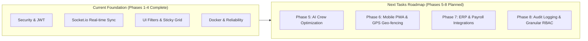

# Future Enhancement Roadmap & Next Tasks Specifications
**Project**: Worker Allocation & Site Management System  
**Document Version**: 2.0  
**Date**: July 28, 2026  
**Status**: Phases 1–4 Completed | Future Phases 5–8 Defined  

---

## 📌 Executive Summary

With **Phases 1 through 4** (Security Hardening, Real-time WebSockets, Interactive UI Filters, and Docker Containerization) successfully implemented and verified, this document outlines the **Next Tasks Roadmap (Phases 5 – 8)**. These future tasks focus on AI workforce optimization, mobile field worker self-service, ERP/payroll integrations, and enterprise compliance audit logging.

---

## 🗺️ Next Tasks Roadmap (Phases 5 – 8)

### Phase 5: AI-Powered Workforce Scheduling & Predictive Optimization

#### Goals & Features
1. **Automated Skill & Trade Matching**:
   - AI recommendation engine suggesting optimal worker allocations based on project scope, trade certification, skill level, and historical site productivity.
2. **Conflict & Overtime Warning System**:
   - Automated detection of impending overtime thresholds (>40 hrs/week), rest interval violations between shifts, and double-booking attempts across overlapping sites.
3. **Crew Density Balancing**:
   - Visual heatmaps identifying under-staffed or over-staffed construction sites relative to project milestone deadlines.

#### Technical Implementation Tasks
- [ ] Create `/api/ai/recommend_crew` endpoint querying trade allocation demand.
- [ ] Build `CrewOptimizerModal.tsx` in frontend offering 1-click intelligent crew distribution.
- [ ] Implement client-side overtime calculation badges on worker cards.

---

### Phase 6: Mobile PWA & GPS Geo-Fenced Worker Portal

#### Goals & Features
1. **Field Worker Self-Service App**:
   - Mobile Progressive Web App (PWA) allowing site workers to view their upcoming weekly schedules and assigned site locations on iOS and Android devices.
2. **GPS Geo-Fenced Clock-In**:
   - Verify worker physical presence within a 150-meter radius of the construction site coordinates when clocking in via mobile device.
3. **QR Code Site Check-In**:
   - Generate unique QR codes for each construction site; foremen can scan worker badges for instant crew check-in.

#### Technical Implementation Tasks
- [ ] Add `vite-plugin-pwa` to `frontend` for offline PWA installation and service worker caching.
- [ ] Create `/api/worker/mobile_clockin` verifying GPS latitude/longitude against project site bounds.
- [ ] Build `WorkerMobileView.tsx` responsive layout optimized for handheld devices.

---

### Phase 7: ERP, Timesheet & Payroll Integrations

#### Goals & Features
1. **Automated Weekly Timesheet Export**:
   - Generate exportable CSV and JSON reports compatible with **Quickbooks**, **Xero**, **Procore**, and **SAP**.
2. **Custom Rate Multipliers**:
   - Support standard time, time-and-a-half (1.5x), double time (2.0x), and night differential rate calculations.
3. **Approval Workflow**:
   - Multi-stage timesheet approval (Site Foreman -> Project Manager -> Payroll Admin).

#### Technical Implementation Tasks
- [ ] Create `/api/reports/payroll_export` with custom date range filters.
- [ ] Implement `TimesheetApprovalModal.tsx` with signature capture for site foremen.
- [ ] Add automated weekly email summary reports to management.

---

### Phase 8: Enterprise Audit Logging & Granular RBAC

#### Goals & Features
1. **Role-Based Access Control (RBAC)**:
   - Fine-grained permission levels:
     - **Super Admin**: Full database, user management, and system configuration access.
     - **Dispatcher**: Allocation dragging, worker site assignments, and schedule edits.
     - **Site Foreman**: Attendance clock-in/out, shift notes, and batch check-ins.
     - **View-Only Visitor**: Read-only access to calendar grid and analytics.
2. **Immutable System Audit Trail**:
   - Complete log of all user actions (worker transfers, status changes, clock-ins, rate edits) recorded with user ID, IP address, timestamp, and before/after state diffs.

#### Technical Implementation Tasks
- [ ] Add `audit_logs` table schema to MySQL database (`id`, `user_id`, `action`, `entity_type`, `entity_id`, `before_state`, `after_state`, `ip_address`, `created_at`).
- [ ] Create `AuditTrailDrawer.tsx` component allowing admins to review historical operational logs.
- [ ] Enforce RBAC permission checks on Express router middleware.

---

## ⏱️ Recommended Timeline & Priority Matrix

| Phase | Description | Complexity | Priority | Target Duration |
| :--- | :--- | :--- | :--- | :--- |
| **Phase 5** | AI Crew Optimization & Overtime Warnings | Medium | High | 2 Weeks |
| **Phase 6** | Mobile PWA & GPS Geo-Fenced Clock-In | High | High | 3 Weeks |
| **Phase 7** | Payroll Exports & ERP Integrations | Medium | Medium | 2 Weeks |
| **Phase 8** | Enterprise Audit Logging & Granular RBAC | High | Medium | 2 Weeks |

---

## 📝 Conclusion

Implementing **Phases 5 through 8** will elevate the Worker Allocation & Site Management System from a powerful real-time dispatcher board into an enterprise-grade construction workforce management suite.
