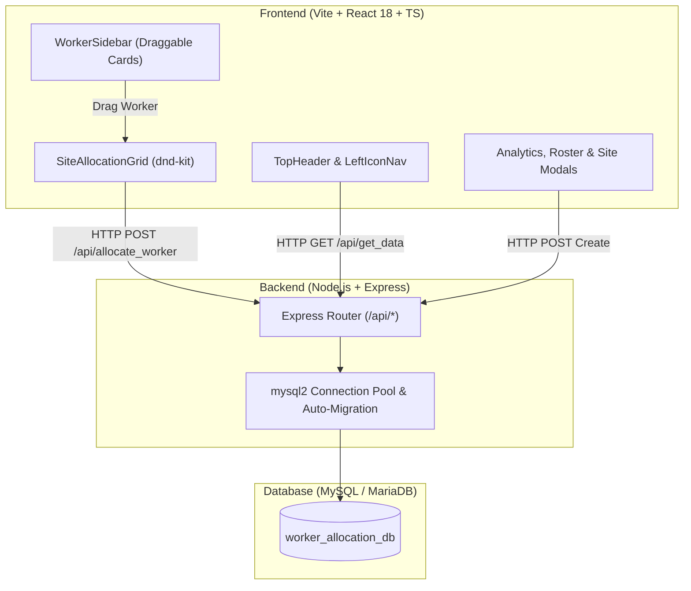
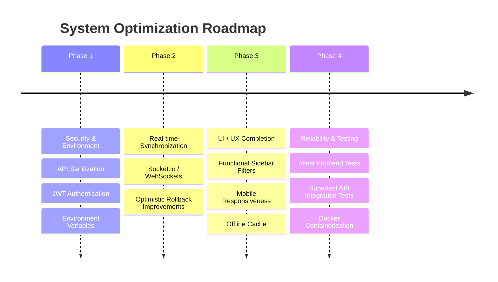

# Comprehensive System Investigation & Technical Report
**Project Name**: Worker Allocation & Site Management System  
**Stack**: React (TypeScript) + Vite + Tailwind CSS v4 | Node.js + Express + MySQL  
**Date**: July 28, 2026  

---

## 1. Executive Summary

The **Worker Allocation & Site Management System** is a full-stack web application designed for construction supervisors, dispatchers, and project managers. It provides a visual, drag-and-drop matrix to assign skilled tradespeople across active construction sites and manage site allocations in real time.

---

## 2. Architecture & Tech Stack

### Frontend Architecture
- **Framework**: React 18 with TypeScript & Vite.
- **Styling**: Tailwind CSS v4 with custom dark mode navy palette (`#090d16`, `#162740`, `#1e3456`) and brand orange accents.
- **Drag-and-Drop Engine**: `@dnd-kit/core` with `PointerSensor` (distance activation constraint of 5px) handling draggable worker cards and droppable calendar cells.
- **Icons & UI Utilities**: `lucide-react` icons, custom Toast notifications, modal overlays, and analytics drawers.

### Backend Architecture
- **Runtime**: Node.js (ES Modules, `"type": "module"`).
- **Web Server**: Express.js REST API running on port `5000` with `cors` and `express.json()` middleware.
- **Database Connector**: `mysql2/promise` with connection pooling configured for WAMP/LAMP environments.
- **Schema Management**: SQL seed script (`schema.sql`) with auto-migration routine (`initDatabase()`) in `db.js` for dynamic column validation.

---

## 3. Core Features & Functional Capabilities

1. **Interactive Site Allocation Matrix (Default Directory & Landing Page)**:
   - 6-day weekly grid (Monday through Saturday) for tracking worker assignments per site.
   - Draggable worker cards with photo, trade icon, and experience level.
   - Auto-transfer capability: Dragging an allocated worker to a different site automatically updates their assignment and releases them from the previous site.

2. **Dynamic Site & Workforce Management**:
   - Modal dialogs for creating new construction site projects and registering new workers with auto-assigned photo avatars and trade metadata.
   - Filterable worker sidebar with real-time text search by name or trade.

3. **Analytics & Roster**:
   - **Analytics Drawer**: Metrics on total active workers, trade distributions, and site allocation density.
   - **Team Roster Modal**: Tabular view of all registered personnel.

4. **Site Allocation Grid Scrolling & Layout**:
   - Scrollable grid wrapper with sticky column headers (`thead`) and sticky left columns (`#` and `Site Name`) ensuring seamless navigation across large site inventories and multi-day columns.

---

## 4. System Pros & Strengths

| Feature | Assessment | Impact |
| :--- | :--- | :--- |
| **User Experience (UX)** | Glassmorphic cards, trade-specific color pills, hover state transitions, and responsive drag handles. | High visual appeal and intuitive dispatcher interaction. |
| **Drag & Drop Logic** | `@dnd-kit/core` integration prevents drag lag and supports optimistic UI state updates. | Instant visual feedback during worker transfer. |
| **Auto-Migration Handler** | `initDatabase()` checks for missing database columns (`time_in`, `hours_worked`, `attendance_status`) on server startup. | Resilient deployment on legacy schemas. |
| **Sticky Grid Navigation** | `sticky top-0` headers and `sticky left-0` site labels maintain context while scrolling. | Scalable for dozens of construction sites and long project lists. |
| **Data Integrity Guard** | Unique database key constraint `UNIQUE KEY (worker_id, day_of_week, allocation_date)` prevents double-booking. | Eliminates scheduling conflicts at the database layer. |

---

## 5. Identified Issues, Vulnerabilities & Limitations

> [!WARNING]
> The following security risks, code smells, and operational limitations were identified during code inspection:

### A. Security & Input Sanitization
1. **SQL String Interpolation Risk**:
   - In `db.js`, `connection.query(\`ALTER TABLE allocations ADD COLUMN ${colName} ${colDef}\`)` uses direct template literals. While `colName` is currently hardcoded internally, this pattern poses SQL injection risks if exposed to dynamic input.
2. **Missing Authentication & Authorization**:
   - All REST API endpoints (`/api/allocate_worker`, `/api/create_project`, `/api/remove_allocation`, `/api/clock_in`) are completely unauthenticated and lack CORS origin restrictions (wildcard `cors()` enabled). Any client on the local network can delete allocations or alter data.
3. **Lack of Request Input Validation**:
   - Endpoints do not use schema validators (e.g. `zod` or `joi`). Malformed payloads or invalid date strings can crash or degrade MySQL query execution.

### B. State Management & Real-Time Synchronization
1. **No Live Multi-User Sync**:
   - Data updates rely on static HTTP requests. If two dispatchers edit allocations simultaneously, changes from Dispatcher A are overwritten by Dispatcher B without real-time updates (WebSocket/Server-Sent Events).
2. **Optimistic UI Rollback Edge Cases**:
   - When an allocation API call fails, `loadData()` re-fetches all state from backend. However, if network latency is high, UI flicker occurs, and temporary allocations may remain stale in component state.

### C. UI / UX & Frontend Code Smells
1. **Incomplete Sidebar Filter Dropdowns**:
   - In `WorkerSidebar.tsx`, buttons for **Trade**, **Skill Level**, and **Status** render static UI dropdown carets without active filter handlers or state binding.
2. **Hardcoded API Endpoint**:
   - `App.tsx` hardcodes `const API_BASE = 'http://localhost:5000/api';` instead of utilizing `import.meta.env.VITE_API_BASE_URL`. This breaks production builds hosted on non-localhost domains.
3. **Silent Error Swallowing in Backend**:
   - `server.js` contains multiple `try { ... } catch (e) { // Ignore }` blocks around database update queries, which can hide database connection drops or schema mismatch bugs.

---

## 6. Recommendations & Enhancement Roadmap

### 1. Security Hardening
- **Add Authentication**: Implement JWT token authentication or Session-based middleware for all Express API endpoints.
- **Implement Input Validation**: Use `zod` schemas for request body validation on `allocate_worker`, `create_worker`, and `clock_in`.
- **Restrict CORS**: Configure CORS whitelist origins to allow only trusted frontend domains.

### 2. Real-Time Collaboration
- **Integrate WebSockets (Socket.io)**: Broadcast allocation changes, transfers, and clock-ins instantly to all connected dispatcher screens to eliminate race conditions.

### 3. Frontend Optimizations & Refactoring
- **Centralize API Base URL**: Move `API_BASE` to standard environment variables (`import.meta.env.VITE_API_BASE_URL`).
- **Complete Sidebar Filters**: Wire up state handlers for Trade, Skill Level, and Status filters in `WorkerSidebar.tsx`.
- **Local Avatar Storage / Fallbacks**: Replace external Unsplash image fallbacks with locally served SVG avatar icons to prevent broken image links when offline.

### 4. Database & ORM Modernization
- **Adopt an ORM**: Replace raw SQL queries with an ORM like **Prisma** or **Drizzle ORM** to ensure end-to-end type safety, structured migrations, and protection against raw query bugs.

### 5. Automated Testing & DevOps
- **Backend Testing**: Implement API route integration tests using `Supertest` and `Vitest` or `Jest`.
- **Frontend Testing**: Add `@testing-library/react` tests for drag-and-drop worker allocations and modal operations.
- **Dockerization**: Provide a `docker-compose.yml` defining Node.js backend, Vite static server, and MySQL container for seamless one-command setup.

---

## 7. Conclusion

The **Worker Allocation & Site Management System** provides a solid, visually compelling foundation for construction workforce dispatching. Its modern UI, responsive drag-and-drop grid, and sticky table navigation make day-to-day site scheduling effortless. By implementing the recommended security enhancements, WebSocket multi-user sync, environment standardization, and ORM integration, the platform can be scaled into an enterprise-ready construction logistics solution.
