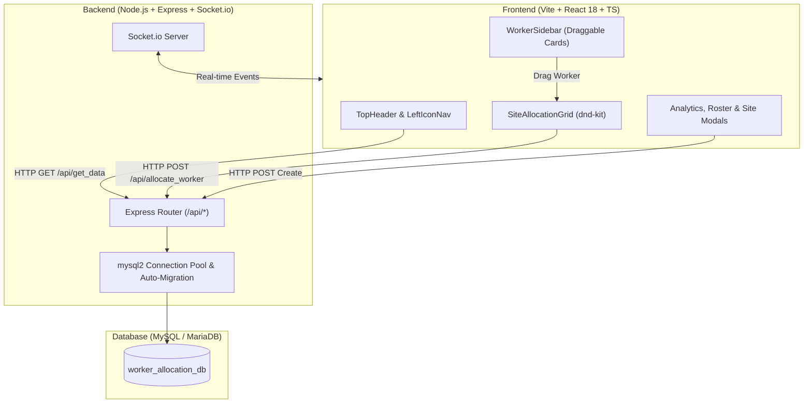
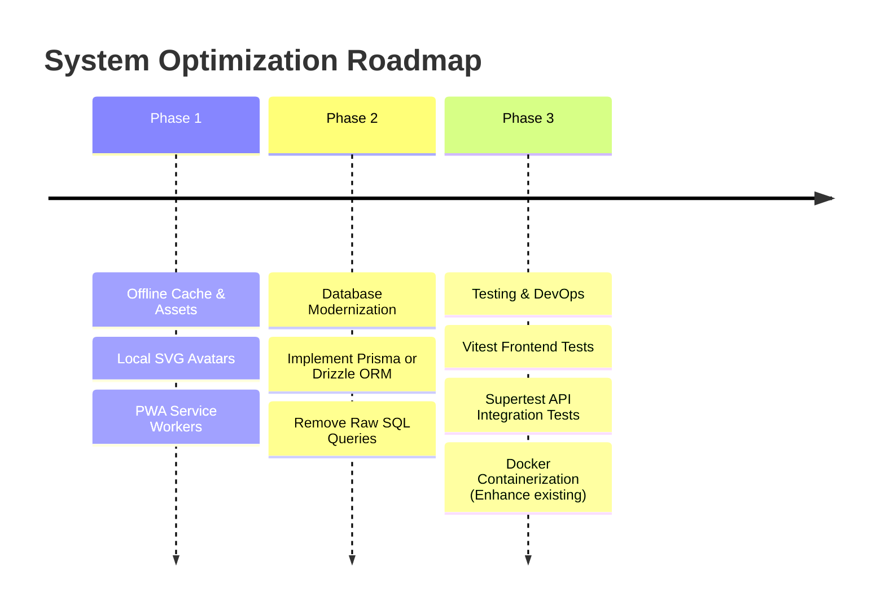

# Comprehensive System Investigation & Technical Report
**Project Name**: Worker Allocation & Site Management System  
**Stack**: React (TypeScript) + Vite + Tailwind CSS v4 | Node.js + Express + MySQL + Socket.io  
**Date**: July 30, 2026 (Updated)

---

## 1. Executive Summary

The **Worker Allocation & Site Management System** is a full-stack web application designed for construction supervisors, dispatchers, and project managers. It provides a visual, drag-and-drop matrix to assign skilled tradespeople across active construction sites and manage site allocations in real time with live WebSocket synchronization.

---

## 2. Architecture & Tech Stack

### Frontend Architecture
- **Framework**: React 18 with TypeScript & Vite.
- **Styling**: Tailwind CSS v4 with custom dark mode navy palette (`#090d16`, `#162740`, `#1e3456`) and brand orange accents.
- **Drag-and-Drop Engine**: `@dnd-kit/core` with `PointerSensor` handling draggable worker cards and droppable calendar cells.
- **State & Real-time**: `socket.io-client` for live syncing of dragging events and allocations.
- **Icons & UI Utilities**: `lucide-react` icons, custom Toast notifications, modal overlays, and analytics drawers.

### Backend Architecture
- **Runtime**: Node.js (ES Modules, `"type": "module"`).
- **Web Server**: Express.js REST API running on port `5000` with `cors`, `helmet`, and rate-limiting middleware (`express-rate-limit`).
- **Real-time Server**: `socket.io` broadcasting live matrix updates.
- **Security & Validation**: JWT-based authentication (`jsonwebtoken`) and schema validation (`zod`).
- **Database Connector**: `mysql2/promise` with connection pooling configured for WAMP/LAMP environments.

---

## 3. Core Features & Functional Capabilities

1. **Interactive Site Allocation Matrix**:
   - 6-day weekly grid for tracking worker assignments per site.
   - Draggable worker cards with photo, trade icon, and experience level.
   - Auto-transfer capability with optimistic UI updates and live real-time sync across connected clients.

2. **Real-time Collaboration & Presence**:
   - Live drag ghosting allows dispatchers to see when another user is moving a worker.
   - Instant WebSocket broadcasts for allocations, site creation, and status updates.

3. **Dynamic Site & Workforce Management**:
   - Modal dialogs for creating new construction site projects and registering new workers.
   - Fully functional filterable worker sidebar with real-time text search and dropdowns for Trade, Skill Level, and Status.

4. **Analytics & Roster**:
   - Analytics Drawer for metrics on total active workers, trade distributions, and site allocation density.
   - Team Roster Modal for tabular view of all registered personnel.

---

## 4. System Pros & Strengths

| Feature | Assessment | Impact |
| :--- | :--- | :--- |
| **Real-time Sync** | `Socket.io` integration with live drag presence and instant updates. | Eliminates scheduling conflicts and race conditions for multi-user dispatching. |
| **Security Hardening** | JWT Authentication, global rate limiters, and `zod` input validation implemented. | Secures endpoints from unauthorized access and malformed payloads. |
| **User Experience (UX)** | Glassmorphic cards, trade-specific color pills, hover state transitions. | High visual appeal and intuitive dispatcher interaction. |
| **Drag & Drop Logic** | `@dnd-kit/core` integration prevents drag lag. | Instant visual feedback during worker transfer. |
| **Data Integrity Guard** | Unique database key constraints. | Eliminates scheduling conflicts at the database layer. |

---

## 5. Identified Issues, Vulnerabilities & Limitations

> [!WARNING]
> The following security risks and operational limitations remain in the current iteration:

### A. Security & Input Sanitization
1. **SQL String Interpolation Risk**:
   - In `db.js`, `connection.query(\`ALTER TABLE allocations ADD COLUMN ${colName} ${colDef}\`)` uses direct template literals. While `colName` is currently hardcoded internally, this pattern poses SQL injection risks if exposed to dynamic input.

### B. UI / UX & Frontend Code Smells
1. **Local Avatar Storage / Fallbacks**:
   - The system still relies on external Unsplash image URLs for avatars. This can result in broken images in offline environments or if external access is restricted.
2. **Silent Error Swallowing in Database Migrations**:
   - Potential silent error swallowing remains in internal DB migration logic where errors might be ignored rather than properly logged or handled.

---

## 6. Recommendations & Enhancement Roadmap

### 1. Offline Reliability
- **Local Avatar Storage**: Replace external Unsplash image fallbacks with locally served SVG avatar icons or base64 strings to prevent broken image links when offline.
- **PWA Capabilities**: Implement service workers for offline caching of the web application.

### 2. Database & ORM Modernization
- **Adopt an ORM**: Replace raw SQL queries with an ORM like **Prisma** or **Drizzle ORM** to ensure end-to-end type safety, structured migrations, and protection against raw query bugs like SQL string interpolation.

### 3. Automated Testing & DevOps
- **Backend Testing**: Implement API route integration tests using `Supertest` and `Vitest` or `Jest`.
- **Frontend Testing**: Add `@testing-library/react` tests for drag-and-drop worker allocations and modal operations.

---

## 7. Conclusion

The **Worker Allocation & Site Management System** provides a solid, visually compelling, and real-time collaborative foundation for construction workforce dispatching. With recent implementations of Socket.io for live synchronization, robust JWT authentication, and Zod validation, the system is highly capable and secure. Transitioning to an ORM and improving offline asset reliability are the primary remaining steps to elevate the platform into a fully enterprise-ready solution.
